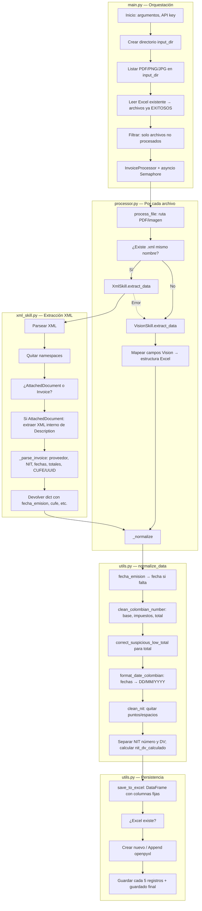

# Arquitectura y flujo del proyecto de scraping de facturas

## Diagrama de flujo: ciclo de vida de una factura

## Explicación de cada paso

### 1. main.py — Orquestación
- **Argumentos y API key**: Se leen `--input_dir`, `--output_file`, `--reset`. Se exige `GOOGLE_API_KEY` (env o getpass).
- **Directorio**: Se crea `input_dir` si no existe.
- **Listado**: Se recorren recursivamente todos los archivos con extensión PDF o imagen (png, jpg, jpeg).
- **Resumen**: Se lee el Excel de salida (si existe) y se obtiene el conjunto de archivos ya procesados con estado EXITOSO para no repetirlos.
- **Filtrado**: Solo se procesan archivos cuyo nombre no esté en ese conjunto.
- **Procesamiento**: Se instancia `InvoiceProcessor` y se lanzan tareas asíncronas (una por archivo, con semáforo 1 y pausa de 15 s entre llamadas para respetar límites de la API).

### 2. processor.py — Procesamiento por archivo
- **process_file**: Recibe la ruta del PDF/imagen. Obtiene la ruta del XML compañero (mismo nombre, extensión `.xml`).
- **Decisión XML**: Si existe ese XML, se intenta extraer con `XmlSkill.extract_data(xml_path)`.
- **XmlSkill**: Si hay XML, se parsea y se extraen los campos; el resultado es un diccionario con la estructura esperada (incluye `fecha_emision`, `cufe`, etc.).
- **Fallback Vision**: Si no hay XML o falla el parseo, se usa `VisionSkill.extract_data(file_path)` (Gemini). La respuesta se mapea a la misma estructura (proveedor, nit, fechas, total, cufe, etc.).
- **_normalize**: Tanto el dato de XML como el de Vision pasan por `utils.normalize_data()` para unificar formato antes de devolver.

### 3. xml_skill.py — Extracción desde XML
- **Parse y namespaces**: Se parsea el XML y se eliminan namespaces de los tags para buscar por nombre.
- **Tipo de documento**: Se distingue entre `AttachedDocument` (contenedor DIAN) e `Invoice` directo.
- **AttachedDocument**: El Invoice real suele estar dentro de `Attachment/ExternalReference/Description` como XML embebido; se parsea ese contenido y se trabaja sobre el árbol interno.
- **_parse_invoice**: Se extraen proveedor, NIT, dirección, teléfono, ciudad, número de factura, fecha emisión/vencimiento, descripción, moneda, base, impuestos, total y **CUFE** (elemento `UUID`). Se devuelve un dict con esas claves.

### 4. utils.py — normalize_data (normalización)
- **fecha**: Si no viene `fecha` pero sí `fecha_emision` (típico del XML), se copia para tener siempre la columna “fecha” unificada.
- **Números**: Se aplica `clean_colombian_number` a base, impuestos y total (símbolos, miles con punto, decimal con coma).
- **Total bajo**: Se aplica `correct_suspicious_low_total` al total (p. ej. valores &lt; 500 se multiplican por 1000 como corrección heurística).
- **Fechas**: Todas las fechas presentes se formatean con `format_date_colombian` a DD/MM/YYYY.
- **NIT**: Se limpia con `clean_nit` (quitar puntos y espacios), se separa número y dígito de verificación (DV) si hay guion, y se calcula `nit_dv_calculado` con el algoritmo módulo 11 (pesos DIAN).

### 5. utils.py — save_to_excel (persistencia)
- **DataFrame**: La lista de diccionarios normalizados se convierte en DataFrame con el orden de columnas fijo (archivo, estado, proveedor, nit, factura_numero, fecha, etc., incluyendo cufe, nit_dv_calculado, nit_dv_extraido, nota).
- **Crear o anexar**: Si no existe el archivo Excel se crea; si existe se anexa con openpyxl (modo append). En fallo se hace concat con lo leído y reescritura completa.
- **Frecuencia**: Desde main se llama a `save_to_excel` cada 5 registros acumulados y al final con los restantes.

---

## Resumen de responsabilidades

| Módulo       | Responsabilidad principal |
|-------------|----------------------------|
| **main.py** | Entrada/salida, listado de archivos, resumen, concurrencia y llamadas a processor + save_to_excel. |
| **processor.py** | Decidir XML vs Vision por archivo, llamar a XmlSkill o VisionSkill, mapear Vision a estructura común y aplicar normalización. |
| **xml_skill.py** | Parsear XML UBL 2.1 (incl. AttachedDocument), extraer campos de factura y CUFE (UUID). |
| **utils.py** | Normalización (fechas, números, NIT, total bajo) y persistencia (save_to_excel, columnas estándar). |

El flujo de una factura es: **entrada (PDF/imagen)** → **decisión XML/Vision** → **extracción (xml_skill o vision_skill)** → **normalización (utils)** → **guardado en Excel (utils)**.
